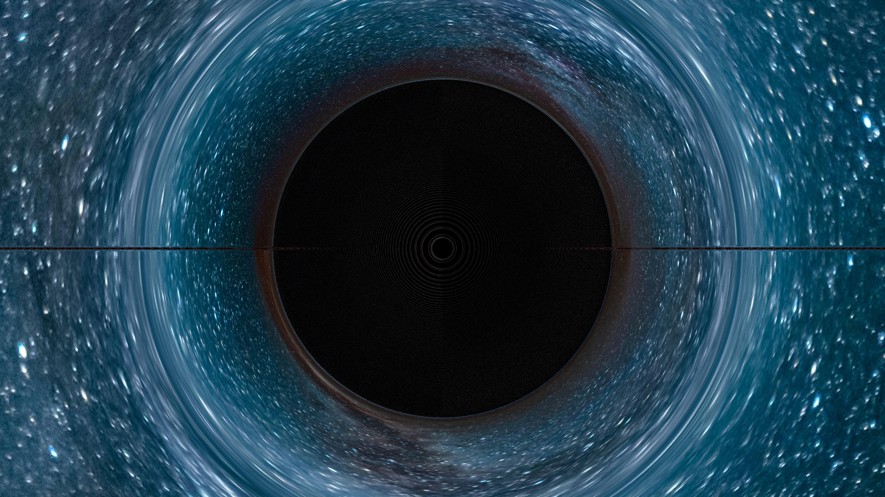

# Schwarzschild Ray Tracer

A high-performance visual simulation of light trajectories around a Schwarzschild black hole. Raytraced using null geodesics through curved spacetime, with results rendered as a colored projection onto a spherical background.

---



---

## Features

* **General relativity simulation** using geodesics in Schwarzschild spacetime
* **Accurate lightlike ray tracing** through numerical integration
* **Background image mapping** for realistic starfield visuals
* **Multithreaded rendering** using OpenMP
* **Test suite** powered by GoogleTest

## File Structure Overview

```
.
├── assets/                  # Background and sample images
│   ├── background.jpg
│   └── sample_output.jpg
├── build/                   # CMake build directory
├── libs/                    # Third-party libraries
│   └── stb/                 # stb_image and stb_image_write
├── math/
│   ├── core/                # Core math utilities
│   │   ├── tensor.hpp
│   │   └── vec4.hpp
│   └── relativity/          # Physics and geodesics
│       ├── geodesic.hpp
│       └── relativity.hpp
├── renderer/               # Rendering logic
│   └── camera.hpp
├── tests/                  # Unit tests with GoogleTest
│   ├── test_vec4.cpp
│   └── test_relativity.cpp
├── CMakeLists.txt          # Top-level build file
├── main.cpp                # Entry point
├── output.jpg              # Rendered output file
└── README.md
```

## Building and Running

### Prerequisites

* CMake >= 3.12
* C++17 compiler
* OpenMP support

### Build Instructions

```bash
# Clone the repository
mkdir build && cd build

# Generate project files
cmake ..

# Build the main application and tests
cmake --build .
```

### Run the Simulation

```bash
./SchwarzschildSim
```

This will render an image to `output.jpg` using the background at `assets/background.jpg`.

## Running Tests

GoogleTest is automatically downloaded via `FetchContent` and compiled.

From the `build/` directory:

```bash
ctest
```

Or run individual test binaries:

```bash
./test_relativity
./test_vec4
```

## Dependencies

* [stb\_image](https://github.com/nothings/stb) – Image loading and saving
* [GoogleTest](https://github.com/google/googletest) – Unit testing

## License

This project is licensed under the terms of the MIT License. See `LICENSE` for more information.

## Credits & Acknowledgments
This project’s mathematical derivations and conceptual architecture for simulating a Schwarzschild black hole in C++ were inspired by James’ tutorial, “Implementing General Relativity: Rendering the Schwarzschild black hole, in C++,” originally published May 31, 2024 on https://20k.github.io/c++/2024/05/31/schwarzschild.html. While the code has been independently developed from the ground up, this post provided the mathematical foundation for the geodesic integration and metric setup.